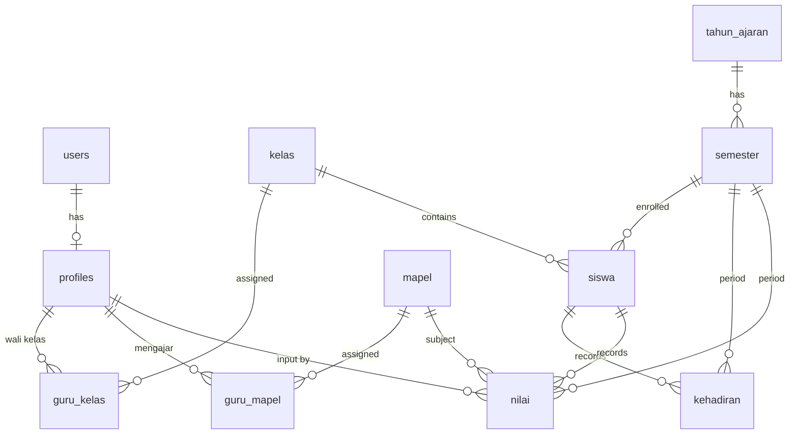

# ARCHITECTURE — Rekap Siswa & Nilai Wali Kelas

## 1. Tech Stack

| Layer | Teknologi |
|-------|-----------|
| **Frontend** | Next.js 14+ (App Router, Server Components) |
| **Styling** | Tailwind CSS (mobile-first responsive) |
| **Backend** | Next.js API Routes + Supabase Client |
| **Database** | Supabase PostgreSQL |
| **Auth** | Supabase Auth (email + password) |
| **Storage** | Supabase Storage (upload Excel) |
| **Hosting** | Vercel |
| **Excel Export** | `xlsx` (SheetJS) library |
| **Excel Import** | `xlsx` (SheetJS) library |

---

## 2. Project Structure

```
src/
├── app/
│   ├── layout.tsx                  # Root layout + font + providers
│   ├── page.tsx                    # Landing → redirect to login/dashboard
│   ├── login/
│   │   └── page.tsx                # Login page
│   ├── (dashboard)/                # Route group — protected, shared layout
│   │   ├── layout.tsx              # Sidebar/bottom nav + auth guard
│   │   ├── dashboard/
│   │   │   └── page.tsx            # Guru dashboard
│   │   ├── kehadiran/
│   │   │   ├── page.tsx            # Rekap kehadiran
│   │   │   └── input/
│   │   │       └── page.tsx        # Input kehadiran (per tanggal / per bulan)
│   │   ├── nilai/
│   │   │   ├── page.tsx            # Rekap nilai + ranking
│   │   │   └── input/
│   │   │       └── page.tsx        # Input nilai per mapel
│   │   ├── siswa/
│   │   │   └── page.tsx            # Kelola siswa + upload Excel
│   │   └── admin/
│   │       ├── users/
│   │       │   └── page.tsx        # CRUD user
│   │       ├── kelas/
│   │       │   └── page.tsx        # CRUD kelas
│   │       ├── mapel/
│   │       │   └── page.tsx        # CRUD mapel
│   │       ├── mapping/
│   │       │   └── page.tsx        # Mapping guru ↔ kelas ↔ mapel
│   │       ├── periode/
│   │       │   └── page.tsx        # Tahun ajaran & semester
│   │       └── data/
│   │           └── page.tsx        # View/edit semua data (pilih guru + mapel)
├── components/
│   ├── ui/                         # Reusable UI primitives (Button, Input, Modal, Table, etc.)
│   ├── layout/                     # Sidebar, BottomNav, Header
│   ├── kehadiran/                  # Komponen spesifik kehadiran
│   ├── nilai/                      # Komponen spesifik nilai
│   └── admin/                      # Komponen spesifik admin
├── lib/
│   ├── supabase/
│   │   ├── client.ts               # Supabase browser client
│   │   ├── server.ts               # Supabase server client (for RSC / API routes)
│   │   └── middleware.ts            # Auth middleware
│   ├── utils.ts                    # Helper functions
│   ├── excel.ts                    # Excel import/export helpers
│   └── types.ts                    # TypeScript types / interfaces
├── hooks/
│   ├── useAuth.ts                  # Auth state hook
│   └── useRole.ts                  # Role-based access hook
└── middleware.ts                   # Next.js middleware (auth + role guard)
```

---

## 3. Database Schema

### 3.1 ERD Overview



### 3.2 Tables

#### `profiles`
Extends Supabase `auth.users`.

| Column | Type | Notes |
|--------|------|-------|
| id | uuid | PK, references `auth.users.id` |
| full_name | text | Nama lengkap |
| role | text | `admin` \| `guru` |
| created_at | timestamptz | |
| updated_at | timestamptz | |

#### `tahun_ajaran`

| Column | Type | Notes |
|--------|------|-------|
| id | uuid | PK |
| nama | text | e.g. "2026/2027" |
| is_active | boolean | Hanya satu yang aktif |
| created_at | timestamptz | |

#### `semester`

| Column | Type | Notes |
|--------|------|-------|
| id | uuid | PK |
| tahun_ajaran_id | uuid | FK → tahun_ajaran |
| tipe | text | `ganjil` \| `genap` |
| is_active | boolean | Hanya satu yang aktif |
| created_at | timestamptz | |

#### `kelas`

| Column | Type | Notes |
|--------|------|-------|
| id | uuid | PK |
| nama | text | e.g. "7A", "8B" |
| created_at | timestamptz | |

#### `mapel` (Mata Pelajaran)

| Column | Type | Notes |
|--------|------|-------|
| id | uuid | PK |
| nama | text | e.g. "Matematika" |
| created_at | timestamptz | |

#### `guru_kelas` (Mapping Guru ↔ Kelas per Semester)

| Column | Type | Notes |
|--------|------|-------|
| id | uuid | PK |
| guru_id | uuid | FK → profiles |
| kelas_id | uuid | FK → kelas |
| semester_id | uuid | FK → semester |
| created_at | timestamptz | |

> Unique constraint: `(guru_id, semester_id)` — satu guru satu kelas per semester.

#### `guru_mapel` (Mapping Guru ↔ Mapel)

| Column | Type | Notes |
|--------|------|-------|
| id | uuid | PK |
| guru_id | uuid | FK → profiles |
| mapel_id | uuid | FK → mapel |
| semester_id | uuid | FK → semester |
| created_at | timestamptz | |

#### `siswa`

| Column | Type | Notes |
|--------|------|-------|
| id | uuid | PK |
| nama | text | Nama lengkap |
| nis | text | Nomor Induk Siswa |
| kelas_id | uuid | FK → kelas |
| semester_id | uuid | FK → semester |
| created_at | timestamptz | |
| deleted_at | timestamptz | Soft delete |

#### `kehadiran`

| Column | Type | Notes |
|--------|------|-------|
| id | uuid | PK |
| siswa_id | uuid | FK → siswa |
| semester_id | uuid | FK → semester |
| tanggal | date | Tanggal kehadiran |
| status | text | `S` \| `I` \| `A` |
| created_at | timestamptz | |
| updated_at | timestamptz | |

> Unique constraint: `(siswa_id, tanggal)` — satu record per siswa per hari.
> Jika tidak ada row = **Hadir**.

#### `komponen_nilai`

| Column | Type | Notes |
|--------|------|-------|
| id | uuid | PK |
| mapel_id | uuid | FK → mapel |
| guru_id | uuid | FK → profiles |
| semester_id | uuid | FK → semester |
| nama | text | e.g. "UH1", "UTS" |
| urutan | int | Urutan tampil (1-5) |
| created_at | timestamptz | |

> Max 5 per (mapel_id, guru_id, semester_id).

#### `nilai`

| Column | Type | Notes |
|--------|------|-------|
| id | uuid | PK |
| siswa_id | uuid | FK → siswa |
| komponen_nilai_id | uuid | FK → komponen_nilai |
| semester_id | uuid | FK → semester |
| nilai | decimal | Nilai angka |
| created_at | timestamptz | |
| updated_at | timestamptz | |

> Unique constraint: `(siswa_id, komponen_nilai_id)`.

#### `nilai_akhir`

| Column | Type | Notes |
|--------|------|-------|
| id | uuid | PK |
| siswa_id | uuid | FK → siswa |
| mapel_id | uuid | FK → mapel |
| guru_id | uuid | FK → profiles |
| semester_id | uuid | FK → semester |
| rata_rata | decimal | Calculated average |
| nilai_akhir | decimal | Editable final score |
| created_at | timestamptz | |
| updated_at | timestamptz | |

> Unique constraint: `(siswa_id, mapel_id, semester_id)`.

---

## 4. Auth & Authorization Flow

```
Request → Next.js Middleware
          ├── Unauthenticated → Redirect /login
          ├── Authenticated (guru) → Allow /dashboard, /kehadiran, /nilai, /siswa
          │                          Deny /admin/*
          └── Authenticated (admin) → Allow semua route
```

- **Supabase RLS** di semua tabel — guru hanya bisa CRUD data kelas/mapel yang di-assign.
- **Admin** bypass RLS via `service_role` key di server-side operations.
- Middleware check role dari `profiles` table (cached di session).

---

## 5. Key Technical Decisions

### 5.1 Kehadiran: Absence-Only Pattern

Tidak simpan row "Hadir". Hanya simpan **S/I/A**. Kueri kehadiran = total hari dikurangi jumlah absence records. Hemat storage.

### 5.2 Nilai Akhir: Materialized

`nilai_akhir` disimpan sebagai row terpisah, bukan computed on-the-fly. Alasan:
- Guru bisa **edit manual** nilai akhir (override rata-rata).
- Ranking query jadi simple `ORDER BY nilai_akhir DESC`.
- Recalculate via trigger atau manual action saat komponen nilai berubah.

### 5.3 Mobile-First Layout

- **Mobile (< 768px)**: Bottom navigation bar, stacked layouts, swipeable tables.
- **Tablet/Desktop (≥ 768px)**: Sidebar navigation, wider table views.

### 5.4 Excel Import/Export

- Import: Parse `.xlsx` client-side via SheetJS → validate → batch insert via Supabase.
- Export: Generate `.xlsx` client-side via SheetJS dari data yang sudah di-fetch.

---

## 6. Deployment

```
GitHub Repo → Vercel (auto-deploy on push)
                ├── Preview deployments (PR branches)
                └── Production (main branch)

Supabase Project (hosted)
  ├── PostgreSQL database
  ├── Auth service
  └── Storage buckets
```

### Environment Variables (Vercel)

```
NEXT_PUBLIC_SUPABASE_URL=
NEXT_PUBLIC_SUPABASE_ANON_KEY=
SUPABASE_SERVICE_ROLE_KEY=
```
